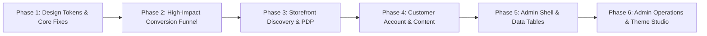

# 🚀 Master UI/UX Improvement Guideline & Roadmap
**Project:** Modern E-Commerce Web Application  
**Tech Stack:** Next.js 16 (App Router), React 19, Tailwind CSS v4, Ant Design 6.x, Redux Toolkit  
**Document Version:** 1.0  
**Target:** Step-by-Step & Module-by-Module UI Overhaul  

---

## 📑 Table of Contents
1. [Executive Summary & Current State Analysis](#1-executive-summary--current-state-analysis)
2. [Global Architecture & Design System Foundation (Phase 0)](#2-global-architecture--design-system-foundation-phase-0)
3. [Module-by-Module UI/UX Improvement Blueprint](#3-module-by-module-uiux-improvement-blueprint)
   - [Module 1: Storefront Shell & Navigation](#module-1-storefront-shell--navigation)
   - [Module 2: Product Discovery & Catalog (Listing, Categories, Brands, Offers)](#module-2-product-discovery--catalog)
   - [Module 3: Product Detail Experience (PDP)](#module-3-product-detail-experience-pdp)
   - [Module 4: Cart, Checkout & Conversion Funnel](#module-4-cart-checkout--conversion-funnel)
   - [Module 5: Customer Portal & Account Management](#module-5-customer-portal--account-management)
   - [Module 6: Authentication & Onboarding](#module-6-authentication--onboarding)
   - [Module 7: Editorial, Content & Policy Pages](#module-7-editorial-content--policy-pages)
   - [Module 8: Admin Dashboard Shell & Global Controls](#module-8-admin-dashboard-shell--global-controls)
   - [Module 9: Admin Analytics & Business Intelligence](#module-9-admin-analytics--business-intelligence)
   - [Module 10: Admin Catalog & Inventory Management](#module-10-admin-catalog--inventory-management)
   - [Module 11: Admin Orders, Logistics & Customer Operations](#module-11-admin-orders-logistics--customer-operations)
   - [Module 12: Admin Marketing, CMS & System Settings](#module-12-admin-marketing-cms--system-settings)
4. [Step-by-Step Implementation Roadmap (Prioritized Phases)](#4-step-by-step-implementation-roadmap-prioritized-phases)
5. [UI Quality Checklist & QA Verification Matrix](#5-ui-quality-checklist--qa-verification-matrix)

---

## 1. Executive Summary & Current State Analysis

An in-depth structural and aesthetic review of the codebase was conducted across all routes (`app/(root)`, `app/(auth)`, and `app/dashboard`), UI components, styling sheets, and layout providers.

### 🔍 Key Findings & Critical UI Bottlenecks

1. **Styling Inconsistencies & Token Fragmentation:**
   - The application has a dynamic appearance setting system in `client/app/layout.tsx` that outputs CSS custom properties (`--global-primary`, `--button-primary-color`, etc.).
   - However, many storefront components hardcode arbitrary Tailwind classes (e.g., `bg-blue-600`, `text-blue-500`, `bg-gray-900`, `bg-[#F8FAFC]`, `text-amber-400`), completely bypassing the merchant's configured theme colors.
   - Tailwind CSS v4 (`@import "tailwindcss";` in `globals.css`) interacts with `tailwind.config.ts`. In Tailwind v4, without `@config "./tailwind.config.ts";`, custom theme tokens like `bg-global-bg` or `font-global-primary-fontfamily` risk being dropped or miscompiled.
   - Heavy usage of `!important` overrides across Ant Design buttons and inputs creates rigid, fragile CSS.

2. **Severe UI Memory & DOM Leaks:**
   - In `client/components/share-component/Card.tsx`, line 147 contains `{global.unAuthorize && <ModalLogin />}`. Because this card component is instantiated for every product in a grid, viewing 24 products mounts **24 redundant modal dialog instances** into the DOM tree, causing unnecessary re-renders, sluggish scrolling, and memory inflation.

3. **Hydration Jumps & Screen Flash (JS-based Layout Switching):**
   - Both the storefront header and dashboard layout rely on `layout.screenWidth > 820` and `global.mobile` checked inside `useEffect` or `useLayoutEffect`.
   - On initial SSR render, elements render desktop or mobile markup and then visibly "snap" or jump when JavaScript executes on the client. Responsive layouts should primarily use CSS media queries and modern CSS container queries.

4. **Iconography & Asset Inconsistency:**
   - Icons are sourced from over 8 distinct libraries (`@ant-design/icons`, `Fa*`, `Fi*`, `Md*`, `Io5*`, `Hi*`, `Rx*`, `Tb*`, `Si*`, `Ci*`).
   - In `NavBarRoute.tsx`, `FaBeer` (a beer mug icon) is copied across 8+ different administrative navigation items (Size, Unit, Color, Taxes, Wishlists, Status, Blog Manage, New Post, Posts), giving an unfinished impression.

5. **Loading, Skeleton & Empty States:**
   - Page transitions often rely on full-screen blocking spinners (`<Spin />`), leading to Cumulative Layout Shift (CLS) and a dated feel.
   - Empty states in tables, search results, and carts lack consistent vector illustrations, friendly typography, and explicit action buttons.

6. **Mobile Touch Ergonomics & Accessibility (a11y):**
   - Certain buttons and interactive touch targets on mobile fall below the WCAG 44x44px recommendation.
   - Form inputs lack uniform focus-visible rings and clear micro-copy error feedback.

---

## 2. Global Architecture & Design System Foundation (Phase 0)

Before updating individual screens, establish a rock-solid foundation to ensure every page benefits automatically from unified colors, typography, and controls.

### 2.1 Tailwind CSS v4 & Theme Token Unification
Ensure `client/app/globals.css` properly links `tailwind.config.ts` in Tailwind v4:
```css
@import "tailwindcss";
@config "../../tailwind.config.ts"; /* Ensure v4 compiler includes custom tokens */
```

Define semantic CSS variables that tie directly into both Tailwind and Ant Design:
- **Surfaces:** `--surface-background`, `--surface-card`, `--surface-subtle`, `--surface-border`
- **Brand Palette:** `--brand-primary`, `--brand-primary-hover`, `--brand-primary-light`, `--brand-secondary`
- **Status:** `--status-success`, `--status-warning`, `--status-danger`, `--status-info`
- **Typography:** `--font-heading`, `--font-body`, with standardized scale: `xs` (11px), `sm` (13px), `base` (15px), `lg` (18px), `xl` (22px), `2xl` (28px), `3xl` (36px).

### 2.2 Global Ant Design Theme Token Harmonization
In `client/app/layout.tsx`, refine the `ConfigProvider` token configuration so Ant Design components seamlessly mirror the storefront design tokens without requiring manual `!important` class overrides:
- Set `borderRadius`: 8px or 12px (based on appearance settings)
- Standardize `controlHeight`: 40px (default), 34px (small), 48px (large)
- Enforce unified typography: `fontFamily: "var(--font-poppins), sans-serif"`

### 2.3 Single Global Modal & Toast Container
- Relocate `<ModalLogin />` exclusively into `app/(root)/layout.tsx` (once for the whole app), controlled via the Redux `unAuthorize` state.
- Standardize notification toasts with consistent position, auto-dismiss duration (3500ms), and custom dark/light styling.

### 2.4 Universal Component Primitives
Create or standardize reusable primitives in `client/components/share-component/`:
- **`AppButton`**: Supports variants (`primary`, `secondary`, `outline`, `ghost`, `danger`), loading state with spinner, and icon slots.
- **`AppBadge`**: Status indicators with soft backgrounds (`success`, `warning`, `error`, `neutral`).
- **`AppSkeleton`**: Reusable animated shimmer blocks for Cards, Tables, and Detail views.
- **`AppEmptyState`**: Cohesive empty illustration with title, subtitle, and primary call-to-action button.

---

## 3. Module-by-Module UI/UX Improvement Blueprint

---

### Module 1: Storefront Shell & Navigation

#### Current Status
- Desktop Header: Features TopBar, Logo, Menu, SearchEngine, CurrencySwitcher, and Action Icons.
- Mobile Navigation: Splits between a thin top header and a fixed bottom navigation bar.
- Issues: Desktop sticky transition causes layout jitter; search input width shifts; mobile bottom navigation overlays floating chat widgets.

#### Proposed Improvements
1. **Top Announcement Bar (`AnnouncementBar.tsx`):**
   - Add gentle marquee or smooth fade transition between multiple promotional messages (e.g., "Free shipping over $50" ⇄ "Use code SUMMER10").
   - Include quick currency / language toggle on the right side.
2. **Main Header (`Header.tsx`, `Menu.tsx`):**
   - Make the header sticky with smooth backdrop blur (`backdrop-blur-md bg-white/90 dark:bg-gray-900/90`).
   - Fix search bar with expandable animated focus state and integrated "Recent Searches" and "Trending Products" dropdown.
   - Standardize category mega-menu: Show high-res category icons, featured subcategories, and promotional banner cards inside the mega dropdown.
3. **Mobile Navigation (`MobileMenu.tsx`):**
   - Modernize the bottom app bar: 5 primary touch items (`Home`, `Categories`, `Search`, `Wishlist`, `Account`) with active indicator pill animation.
   - Badge counter on Cart and Wishlist icons with spring animations.
   - Implement bottom-sheet drawer for mobile category navigation with nested accordion drill-downs.
4. **Footer (`Footer.tsx`):**
   - Reorganize into a clean 4-column layout: About/Brand, Quick Links, Customer Service, Newsletter Signup.
   - Trust seals (Payment methods, SSL 256-bit secure badge, Money-back guarantee).
   - Clean copyright bar with social icons using consistent hover elevation.

---

### Module 2: Product Discovery & Catalog

**Routes:**
- Catalog Listing: `/products`
- Categories: `/categories`, `/categories/[slug]`
- Brands: `/brand`, `/brand/[brand]`
- Special Offers: `/offers`, `/offers/[slug]`

#### Current Status
- Product listing combines desktop sidebar with floating cart button.
- On mobile, sidebar filter simply disappears without an accessible mobile facet drawer.
- Product card has hardcoded blue accents, discount tag clipping, and redundant login modals.

#### Proposed Improvements
1. **Product Card Redesign (`Card.tsx`):**
   - **Architectural Fix:** Immediately remove `<ModalLogin />` from the card loop.
   - **Media Frame:** Fixed 1:1 or 4:5 aspect ratio container with subtle neutral background (`bg-gray-50`), preventing layout shift during image load.
   - **Quick Actions:** Subtle hover overlay with Quick View (modal), Add to Wishlist (with heart pop animation), and Add to Cart.
   - **Badges:** Dynamic floating pill tags (`New`, `-20%`, `Low Stock`, `Out of Stock`) using semantic colors.
   - **Typography:** Product title with fixed 2-line clamp, clean brand link, star rating with review count, and distinct bold price presentation with strikethrough original price.
2. **Faceted Filter Sidebar (`FilterSidebar/Index.tsx`):**
   - Reusable between desktop sticky sidebar and mobile slide-over Drawer.
   - Collapsible filter sections: Price Range Slider with direct number inputs, Color Swatches (color circle chips with tooltips), Size Grid, Brand Checkboxes with live search, Rating filter.
   - Active Filter Chips bar above results with "Clear All" button.
3. **Category & Brand Grid Pages:**
   - Visual category cards with circular or soft-square imagery and product count badges.
   - Alphabetical quick jump index for `/brand` page.
   - Skeleton grid loader replacing blank spinners during filter requests.

---

### Module 3: Product Detail Experience (PDP)

**Routes:** `/products/[slug]`

#### Current Status
- PDP contains image gallery, product information, delivery info, and review tabs.
- Layout feels dense; variant selection lacks visual clarity on unavailable options; mobile view requires significant scrolling to reach Add-to-Cart.

#### Proposed Improvements
1. **Interactive Image Gallery (`ProductImageGallery.tsx`):**
   - Dual layout: Vertical thumbnail strip + large preview on desktop; full-bleed swipeable carousel with pagination dots on mobile.
   - Smooth image zoom on hover and click-to-expand lightbox.
2. **Product Configuration & Purchase Zone (`ProductDetails.tsx`):**
   - Clear price block showing discount percentage badge, SKU, and stock availability badge (`In Stock`, `Only 3 left`, `Backorder`).
   - **Color Variant:** Color circles with ring selection state and selected color name label.
   - **Size / Attribute Variant:** Pill-style option chips with crossed-out line for out-of-stock sizes.
   - **Quantity Selector:** Stepper with debounced input and validation limit.
   - **CTA Hierarchy:** High-contrast Primary "Add to Cart" button + Secondary "Buy Now" button with icon accents.
3. **Sticky Mobile Action Bar:**
   - When user scrolls past the main buy buttons on mobile, display a bottom floating bar with thumbnail, price, and "Add to Cart" button for high conversion.
4. **Trust, Shipping & Delivery Accordion (`DeliveryInfo.tsx`):**
   - Estimated delivery calculator based on postal code/district.
   - Return policy summary and guaranteed authentic badge.
5. **Customer Reviews & Social Proof (`RatingProducts.tsx`):**
   - Aggregate rating breakdown bar chart (5 star to 1 star percentage).
   - Filter reviews by rating and verified purchaser badge.
   - Review submission form with star rating picker and photo upload preview.

---

### Module 4: Cart, Checkout & Conversion Funnel

**Routes:**
- Cart Drawer: `ViewCart.tsx`
- Checkout Flow: `/checkout`

#### Current Status
- Cart Drawer is functional but has text contrast and button styling issues.
- Checkout page displays Shipping, Items, and Payment in one long vertical stack, while the summary sidebar uses aggressive black borders (`border-2 border-gray-900`) and arbitrary blur circles.

#### Proposed Improvements
1. **Slide-Over Cart Drawer (`ViewCart.tsx`):**
   - **Free Shipping Gamification:** Animated progress bar indicating "$X away from Free Shipping".
   - **Item Row:** High quality thumbnail, title, selected variant chips, inline quantity stepper, item total, and soft delete button with confirmation or quick undo.
   - **Cart Recommendations:** "You might also like" compact mini-carousel at the bottom before checkout.
   - **Sticky Footer:** Subtotal, estimated tax/shipping note, and prominent "Proceed to Checkout" button with lock icon.
2. **Streamlined Checkout Experience (`CheckoutPage.tsx`):**
   - **Progressive Disclosure (Accordion or Stepper):**
     - *Step 1: Shipping Address* (Saved address cards with "Deliver Here" radio selection or Add New Address modal).
     - *Step 2: Shipping Method* (Standard vs Express with cost & timeline).
     - *Step 3: Payment Method* (Tabbed cards: COD, Credit/Debit Cards with logos, Digital Wallets, Mobile Banking).
   - **Floating Order Summary (`CheckoutSummary.tsx`):**
     - Clean modern card without abrasive thick black borders.
     - Expandable coupon code input with instant success/error feedback pill.
     - Line items overview with collapsible toggle to save vertical space.
     - Security reassurance badges (SSL, encrypted payments, money-back assurance).
   - **Post-Checkout / Order Confirmation (`/checkout/success`):**
     - Animated checkmark celebration, order reference number, order tracking link, and printable receipt button.

---

### Module 5: Customer Portal & Account Management

**Routes:** `/profile` (Tabs: `my_account`, `orders`, `wishlist`, `shipping_address`, `track_order`, `notification`, `change_password`)

#### Current Status
- Profile uses a horizontal scroll bar on mobile and a sidebar on desktop.
- Sub-components have mismatched card styling, basic tables, and inconsistent form controls.

#### Proposed Improvements
1. **Profile Layout & Mobile Navigation:**
   - Desktop: Sleek account sidebar with user avatar, name, email, membership tier, and navigation items with active left pill indicator.
   - Mobile: Clean segmented control or top scrollable pill list with sticky behavior and smooth swipe animations.
2. **My Account Tab (`MyAccount.tsx`):**
   - Profile summary card with photo upload avatar picker.
   - 2-column editable form with clear label/input pairs, phone verification status, and "Save Changes" floating action.
3. **Orders & Order Tracking (`UserOrders.tsx`, `OrderTracker.tsx`):**
   - Modern order card: Order ID, placed date, status badge with color coding (`Pending`: amber, `Processing`: blue, `Shipped`: purple, `Delivered`: green, `Cancelled`: red).
   - Order items preview with thumbnail row.
   - Step-by-step visual timeline for shipping progress (Placed ➔ Confirmed ➔ Shipped ➔ Out for Delivery ➔ Delivered).
   - Quick action buttons: "Track Package", "Download Invoice (PDF)", "Request Return", "Buy Again".
4. **Wishlist Tab (`MyWishlist.tsx`):**
   - Grid of saved items with direct "Move to Cart" button, price alert indicator, and single-click remove icon.
   - Empty state with "Explore Products" recommendation.
5. **Address Book (`ShippingAddressList.tsx`):**
   - Visual address cards with "Default" badge, edit modal with district/city dropdowns, and Google Maps pin picker (optional).

---

### Module 6: Authentication & Onboarding

**Routes:**
- `/login`, `/register`, `/forgot-password`, `/reset-password/[token]`
- Modal Login: `ModalLogin.tsx`

#### Current Status
- Authentication pages have scattered styling, inconsistent social login buttons, and plain text validation messages.

#### Proposed Improvements
1. **Modern Split-Screen Layout:**
   - Left side: High-aesthetic brand imagery, customer testimonial quote, or seasonal product showcase.
   - Right side: Clean, focused authentication card with logo, welcoming title, and social sign-in (Google, Facebook, Apple).
2. **Form Interaction & Validation:**
   - Floating label or crisp top-label inputs with prefix icons.
   - Password strength indicator meter (Weak ➔ Fair ➔ Strong) with real-time requirement checkmarks on register page.
   - Show/Hide password toggle button.
   - Smooth inline error feedback with animated shake or slide-down helper text.
3. **Seamless Modal Login (`ModalLogin.tsx`):**
   - Lightweight dialog with backdrop blur, tabbed between Login and Register, designed to allow instant checkout without leaving current flow.

---

### Module 7: Editorial, Content & Policy Pages

**Routes:**
- Blog: `/blog`, `/blog/[slug]`
- Informational: `/about`, `/contact`, `/shipping-policy`, `/terms-conditions`, `/privacy-policy`, `/support-and-help`

#### Proposed Improvements
1. **Blog Listing & Article Detail (`/blog`, `/blog/[slug]`):**
   - Blog Listing: Featured hero article + 3-column responsive card grid with reading time pill, author avatar, category tag, and date.
   - Article Detail: Focused reading width (max-w-3xl), large header image, readable typography (`prose` classes), social share sticky bar, and related posts carousel.
2. **Contact & Support Hub (`/contact`, `/support-and-help`):**
   - Contact Page: Clean 2-column layout (Left: interactive contact form; Right: support channels with WhatsApp, Email, Live Chat hours, and embedded map).
   - FAQ Accordion with instant search filter to solve customer queries faster.
3. **Policy Pages (`/privacy-policy`, `/terms-conditions`, etc.):**
   - Clean sidebar table of contents with smooth scroll spy highlighting the active section.
   - Standardized typography with clean heading anchors and "Last updated" date badge.

---

### Module 8: Admin Dashboard Shell & Global Controls

**Routes:** Dashboard Layout (`app/dashboard/layout.tsx`, `components/dashboard/Sidebar.tsx`, `components/dashboard/Header.tsx`, `NavBarRoute.tsx`)

#### Current Status
- 30+ navigation items crowded in sidebar.
- Multiple placeholder icons (`FaBeer`) used across 8 menu items.
- Hardcoded `text-blue-500` throughout navigation icons.
- Margin left on content is calculated via window resize events in JavaScript rather than CSS layout rules.

#### Proposed Improvements
1. **Sidebar Navigation Overhaul (`Sidebar.tsx`, `NavBarRoute.tsx`):**
   - **Replace all placeholder icons:** Use consistent Lucide or Ant Design SVG icons tailored to each module (e.g., `IoColorPaletteOutline` for Colors, `FaRulerCombined` for Sizes, `MdReceiptLong` for Taxes, `BsSuitHeart` for Wishlists, `MdOutlineArticle` for Blog Posts).
   - **Logical Grouping:** Re-categorize items into collapsible sections with subtle dividers:
     - 📊 *Core:* Dashboard, Analytics, Audit Logs
     - 🛍️ *Catalog:* Products, Categories, Attributes (Colors, Sizes, Units), Media Library
     - 📦 *Sales & Fulfillment:* Orders, Returns, Refunds, Shipping (Charges, Addresses), Payments
     - 🎯 *Marketing & CMS:* Discounts, Coupons, Banners, Blog Posts, Reviews, Contacts
     - 👥 *Customers & Access:* Customers, Users & Roles, Wishlists, Notifications
     - ⚙️ *Settings:* General Settings, Appearance Studio, Taxes, Stock Adjustments
   - **Modern Sider Mechanics:** Use Ant Design Sider's native responsive breakpoints or CSS variable `--sidebar-width` to eliminate content jumping.
2. **Top Header Bar (`DashboardHeader.tsx`):**
   - Global Search Command Palette (`Cmd + K` or `Ctrl + K`) allowing instant jump to any order ID, product name, or dashboard route.
   - Modernized notification center with unread badge counter, notification categorization (Orders, Stock alerts, System), and "Mark all as read" button.
   - Storefront quick switcher: "View Live Store" button opening the shop in a new tab.
   - Refined user dropdown with profile photo, role badge, quick settings, and safe sign-out.

---

### Module 9: Admin Analytics & Business Intelligence

**Routes:** `/dashboard`, `/dashboard/report`, `/dashboard/audit-logs`

#### Current Status
- Summary cards, profit & loss chart, stock alert table, and top customer widgets are visually disconnected.
- Date range picker styling doesn't blend cleanly with header cards.

#### Proposed Improvements
1. **KPI Metric Stat Cards (`TodayOrderSummary.tsx`):**
   - 4-card metric row: Total Revenue, Total Orders, Average Order Value (AOV), Active Customers.
   - Trend indicators (+12.5% vs last month) with green/red trend arrows and sparkline mini-charts.
2. **Interactive Charting Suite:**
   - Unify chart themes with global brand color palette.
   - Profit & Loss bar/area charts with toggleable time horizons (Today, 7D, 30D, 1Y).
   - Category sales distribution donut chart with clean legend.
3. **Actionable Alerts & Tables (`StockAlert.tsx`, `DataTable.tsx`):**
   - Low stock alert table with priority pill (`Critical: 0 left`, `Warning: < 5 left`) and one-click "Restock / Adjust" action modal.
   - Recent orders quick list with status badges and quick view drawer.

---

### Module 10: Admin Catalog & Inventory Management

**Routes:**
- Products: `/dashboard/product`, `/dashboard/product/new`, `/dashboard/product/[id]`, `/dashboard/product/[id]/edit`
- Taxonomy: `/dashboard/category`, `/dashboard/color`, `/dashboard/size`, `/dashboard/unit`
- Media Library: `/dashboard/media`

#### Current Status
- Product list table has cluttered columns, basic text search, and limited filtering.
- Product creation and editing form is excessively long and lacks segmented section navigation.

#### Proposed Improvements
1. **Enterprise Data Table Standard (`ProductList.tsx`):**
   - **Toolbar:** Debounced search, category filter dropdown, stock status filter (`All`, `In Stock`, `Low Stock`, `Out of Stock`), visibility filter (`Featured`, `New Arrival`), and "Columns" customizer dropdown.
   - **Bulk Actions:** Floating selection bar when checkboxes are clicked ("Selected 5 items: [Change Status] [Apply Discount] [Delete Selected]").
   - **Image Cell:** Compact 44x44px preview thumbnail with zoom tooltip on hover.
   - **Inline Quick Edit:** Inline toggle switch for `Status`, `Featured`, and `New Arrival` with instant optimistic update.
2. **Product Create / Edit Form (`AddProduct.tsx`):**
   - Split long form into sticky tabbed anchors or card sections:
     - *Basic Information:* Title, Slug, Short Description, Category & Brand selectors.
     - *Media & Gallery:* Drag-and-drop file uploader with multi-image reordering and crop tool.
     - *Pricing & Inventory:* Regular price, Sale price, Cost per item, SKU, Barcode, Stock quantity, Alert threshold.
     - *Variants Matrix:* Dynamic generator for Color x Size x Weight combinations with bulk price/stock fill.
     - *SEO & Social Metadata:* Live Google Search snippet preview.
   - Floating footer bar with "Discard Changes" and "Save Product" buttons.
3. **Media Library (`/dashboard/media`):**
   - Masonry or uniform grid view with file search, tag filtering, image metadata drawer (dimensions, size, URL copy button), and bulk deletion.

---

### Module 11: Admin Orders, Logistics & Customer Operations

**Routes:**
- Orders: `/dashboard/orders`
- Returns: `/dashboard/return`
- Refunds: `/dashboard/refunds`
- Payments: `/dashboard/payments`, `/dashboard/payments/[new]`
- Shipping: `/dashboard/shipping-charges`, `/dashboard/shipping-address`
- Customers: `/dashboard/customers`
- Access Control: `/dashboard/user`

#### Proposed Improvements
1. **Order Management Hub (`/dashboard/orders`):**
   - Status Tabs: `All`, `Unfulfilled / Pending`, `Processing`, `Shipped`, `Delivered`, `Cancelled`, `Returned`.
   - Actionable table cells: Customer name with phone tooltip, payment method pill, delivery badge, order grand total.
   - Order Detail Drawer / Modal: Customer info, shipping address, ordered item thumbnails, price breakdown, status change dropdown, and "Print Packing Slip / Invoice" button.
2. **Returns & Refunds Workflow (`/dashboard/return`, `/dashboard/refunds`):**
   - Return review modal with uploaded product photos from customer, reason for return, and one-click "Approve & Initiate Refund" or "Reject with Reason".
   - Refund calculation summary displaying original payment method and transaction ID.
3. **Shipping & Delivery Configurations (`/dashboard/shipping-charges`):**
   - Clean matrix view of charges by district/zone.
   - Condition-based rules builder (e.g., "Free shipping if Cart Total > 5,000").
4. **Customer CRM View (`/dashboard/customers`):**
   - Customer profile drawer displaying customer lifetime value (LTV), total orders, average rating given, and direct WhatsApp / Email contact button.

---

### Module 12: Admin Marketing, CMS & System Settings

**Routes:**
- Marketing: `/dashboard/discounts`, `/dashboard/coupons`, `/dashboard/banner`
- CMS: `/dashboard/post`, `/dashboard/contacts`, `/dashboard/review`
- System: `/dashboard/general-setting`, `/dashboard/taxs`, `/dashboard/stock-adjust`, `/dashboard/other-modules`

#### Proposed Improvements
1. **Coupons & Discounts Builder (`/dashboard/coupons`, `/dashboard/discounts`):**
   - Visual coupon preview ticket showing discount code, badge (-15% or $10 Off), expiration date, and minimum spend requirements.
   - Simple validation builder (Applies to: All products, Specific categories, or Minimum cart value).
2. **Banner & Homepage Layout Manager (`/dashboard/banner`, `PageLayoutSettings.tsx`):**
   - Drag-and-drop reordering for homepage sections (Slider, Featured, Categories, Banners).
   - Aspect ratio indicator and device preview (Desktop vs Mobile) for slider banners.
3. **Appearance Settings Studio (`AppearanceSettings.tsx`):**
   - Group the 40+ appearance inputs into intuitive cards with live mini-preview:
     - 🎨 *Colors:* Brand Primary, Secondary, Backgrounds, Text
     - 🔠 *Typography:* Google Font Picker, Base Sizes, Heading Scale
     - 🔘 *Buttons & Controls:* Radius, Padding, Shadow, Button Hover Styles
     - 📱 *Header & Footer:* TopBar color, Header style, Footer layout
   - Include predefined curated theme presets ("Classic Minimal", "Bold Fashion", "Tech Modern", "Organic Clean") for one-click color scheme selection.

---

## 4. Step-by-Step Implementation Roadmap (Prioritized Phases)

To execute this UI improvement systematically without breaking existing functionality, follow this 6-phase roadmap:



### Phase 1: Design Tokens, Architecture & Core Fixes (Sprint 1)
- [ ] Connect `tailwind.config.ts` into Tailwind v4 in `globals.css` with `@config`.
- [ ] Remove duplicate `<ModalLogin />` inside `Card.tsx` and place a single provider instance in `(root)/layout.tsx`.
- [ ] Harmonize CSS variables and Ant Design theme tokens in `layout.tsx`.
- [ ] Build shared UI primitives: `AppButton`, `AppBadge`, `AppSkeleton`, `AppEmptyState`.
- [ ] Remove placeholder icons (`FaBeer`) in `NavBarRoute.tsx` and assign semantic Lucide/Antd icons.

### Phase 2: High-Impact Conversion Funnel (Sprint 2)
- [ ] Redesign the Cart Drawer (`ViewCart.tsx`): Add free shipping progress bar, cleaner row items, and sticky footer.
- [ ] Revamp Checkout Flow (`CheckoutPage.tsx`): Replace monolithic vertical layout with 3-stage progressive disclosure.
- [ ] Redesign floating Order Summary and Coupon input with instant validation feedback.
- [ ] Build post-purchase Order Success confirmation page.

### Phase 3: Storefront Discovery & Product Detail Experience (Sprint 3)
- [ ] Overhaul Product Card (`Card.tsx`): Standardize 4:5 image container, badges, pricing, and hover interactions.
- [ ] Rebuild Catalog Page (`/products`): Add responsive filter drawer for mobile and active facet chips.
- [ ] Upgrade Product Detail Page (`/products/[slug]`): Swipeable image gallery, pill variant selectors, and sticky mobile Add-to-Cart bar.
- [ ] Refactor Storefront Header & Mobile Navigation: Smooth backdrop blur and mobile app-bar dock.

### Phase 4: Customer Portal, Auth & Content Pages (Sprint 4)
- [ ] Refactor Customer Profile (`/profile`): Modern responsive tab navigation, visual order timeline tracker, and address cards.
- [ ] Upgrade Auth Pages (`/login`, `/register`, `ModalLogin.tsx`): Modern split-screen layout and password strength meter.
- [ ] Modernize Blog (`/blog`, `/blog/[slug]`) with clean reading typography and contact FAQ accordion.

### Phase 5: Admin Dashboard Shell & Data Tables (Sprint 5)
- [ ] Reorganize Admin Sidebar into logical categorized collapsible sections with unified iconography.
- [ ] Eliminate JS resize calculations in `DashboardLayout` by using CSS responsive margins and variables.
- [ ] Create standardized reusable `AdminDataTable` with search debounce, status badges, bulk actions, and pagination.
- [ ] Refactor Product List (`/dashboard/product`) and Product Add/Edit Form (`/dashboard/product/new`) into tabbed cards.

### Phase 6: Admin Operations, Analytics & Appearance Studio (Sprint 6)
- [ ] Redesign Overview Dashboard (`/dashboard`): Metric KPI cards with trend indicators and themed analytics charts.
- [ ] Upgrade Order Management (`/dashboard/orders`): Order detail drawer and invoice print template.
- [ ] Enhance Appearance Studio (`AppearanceSettings.tsx`): Curated theme presets and live preview cards.
- [ ] Comprehensive responsive and cross-browser visual verification.

---

## 5. UI Quality Checklist & QA Verification Matrix

Before completing each module, verify against the following quality standards:

### 📱 Responsive Breakpoints Matrix
- [ ] **Mobile Small (360px - 390px):** Test on iPhone SE & Android devices; ensure no horizontal scroll or text overlapping.
- [ ] **Mobile Standard (390px - 430px):** Test on modern iPhone/Pixel; touch targets must be at least 44x44px.
- [ ] **Tablet (768px - 820px):** Verify sidebar collapse behavior and 2-column or 3-column product grids.
- [ ] **Desktop (1280px - 1536px+):** Verify max-w containers (`container mx-auto px-4 sm:px-6 lg:px-8`) with proper breathing room.

### 🎨 Visual & Aesthetic Standards
- [ ] Dynamic appearance colors respected without hardcoded blue/amber overrides unless intentionally designated.
- [ ] Consistent font hierarchy: Headings use Primary Font, Body and UI labels use Secondary Font.
- [ ] Status badges follow consistent semantic colors (Success: Green, Warning: Amber, Danger: Red, Neutral: Gray).
- [ ] Hover and active states have smooth transitions (`transition-all duration-200` or `300ms`).

### ⚡ Performance & Ergonomics
- [ ] Image assets specify `sizes` and proper Next.js `<Image />` dimensions to prevent Cumulative Layout Shift (CLS).
- [ ] All table and card lists have skeleton loaders during data fetch rather than empty screen flashes.
- [ ] Zero duplicate modal or drawer mounts in list item loops.
- [ ] All forms provide explicit validation feedback upon submit and inline error clearing on change.

---

*This guideline serves as the official master document for the UI improvement project. Each phase and module can be assigned and executed sequentially.*

